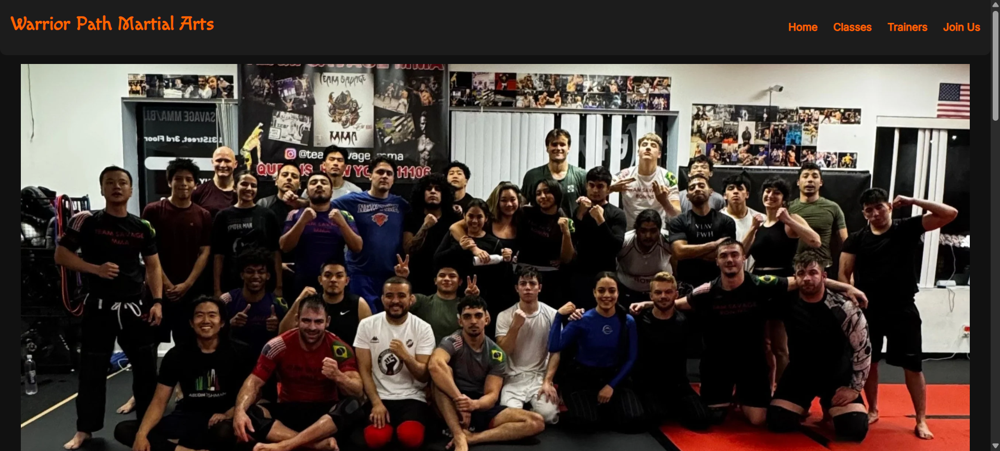
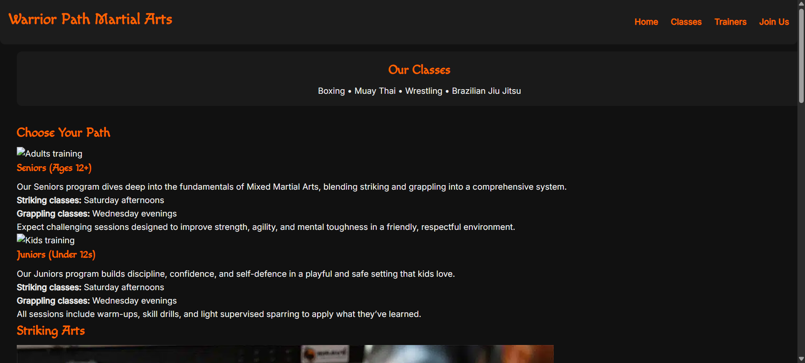
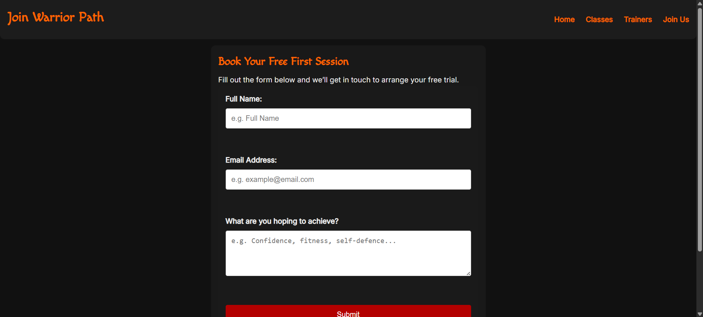
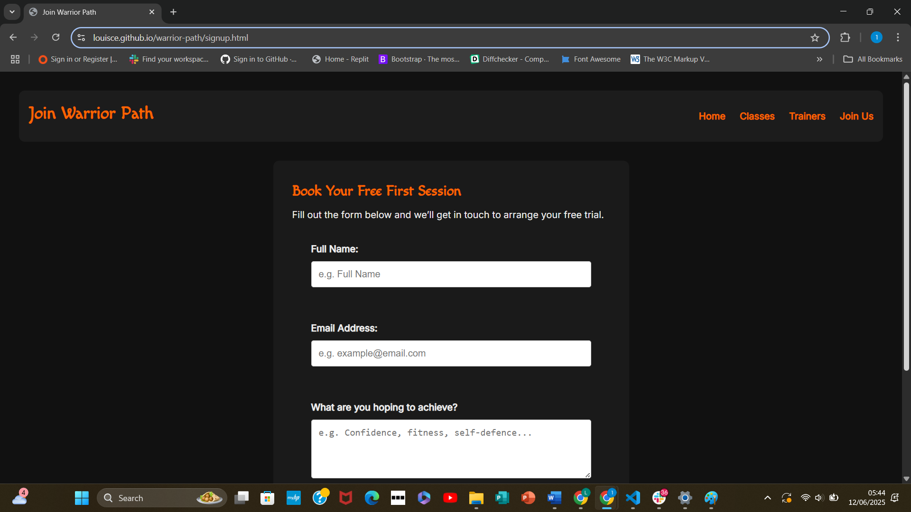

# Warrior Path

Warrior Path is a fictional martial arts gym website developed as part of a front-end development project for Code Institute in 2025. This project demonstrates skills in responsive design, accessibility, and front-end best practices using HTML, CSS and Bootstrap.

## Purpose

This project simulates the development of a professional front-end website for a martial arts gym, intended to showcase a clean, accessible, and responsive design. The goal is to create a clean, accessible and responsive website that aims to provide visitors with clear and easy access to essential information such as class offerings, trainer profiles, educational content on mixed martial arts (MMA) and membership sign-ups. This project also emphasises practical application of UX principles while showcasing semantic HTML, and CSS best practices.

## Value to Users

The website helps users understand what the school offers, who the instructors are, and how to sign up. It also gives them an impression of the school's tone and style. Clear navigation and responsive design make it easy to use on any device. Users can quickly find detailed class information, learn about the expertise of trainers, and easily join the gym through an intuitive sign-up form. The website's responsive design ensures seamless usability across devices, while accessibility makes it inclusive for users with visual impairments.

## Key Features

- **Responsive Layout:** Utilizes Bootstrap 5’s grid system and media queries to ensure the site adapts elegantly to all screen sizes.
- **Navigation:** Fully functional, sticky navigation bar with clear active states provides easy and consistent site navigation.
- **Consistent Styling:** Harmonised color palette and typography maintain a professional and approachable brand image. A dark theme was chosen for the background to create a sleek, professional appearance. Red was considered too aggressive for a martial arts website, so orange was chosen instead to add vibrancy and pop against the dark background.
- **Custom Forms:** Accessible and user-friendly sign-up form with validation prompts to facilitate membership registration.
- **Standards Compliant:** HTML and CSS validated with zero errors, ensuring cross-browser compatibility and clean code.
- **Accessibility:** Designed with keyboard navigation and ARIA attributes to support users with disabilities.

## Pages Included

- Home (`index.html`)
- Classes (`classes.html`)
- Trainers (`trainers.html`)
- Join Us (`signup.html`)

## Deployment

The website is deployed using GitHub Pages and is accessible at:  
[https://louisce.github.io/warrior-path/](https://louisce.github.io/warrior-path/)

## Technologies Used

- HTML5
- CSS3
- Bootstrap 5 (via CDN)
- Git and GitHub for version control and deployment

## Screenshots

_Screenshots of each page and key feature will be included here._

### Home Page

### Classes Page

### Trainers Page

### Sign Up Page

### Signup Page (Test Screenshot)

## Attribution

- Bootstrap 5 provided via official CDN: https://getbootstrap.com/
- - Fonts used: [e.g. Google Fonts - Open Sans](https://fonts.google.com/specimen/Open+Sans)

## Accessibility

This website supports keyboard navigation to enhance accessibility. Interactive elements such as navigation links and call-to-action (CTA) buttons have visible `:focus` styles, allowing users who navigate using the Tab key to clearly see which element is currently selected. The focus styles use a high-contrast orange (#ffa040) consistent with the hover styles for visual continuity. Additionally, form inputs and buttons highlight on focus to assist users relying on keyboard interaction.

### Accessibility Testing

**Keyboard Navigation Test:**  
Pressing the Tab key cycles through all interactive elements (links, buttons, form fields). Each focused element is clearly highlighted with a bright orange outline or underline. No elements are skipped, and focus order is logical.
**Result:** Pass

## How to Run/Preview the Project

You can preview the website locally by opening the HTML files directly in your web browser. No additional setup is required.

Alternatively, view the live site hosted on GitHub Pages at:  
[https://louisce.github.io/warrior-path/](https://louisce.github.io/warrior-path/)

## Bug & Testing Log

- Tested the website on Chrome, Firefox, and Edge on both desktop and mobile devices using device emulation.
- HTML and CSS files were validated using W3C and Jigsaw validators with zero errors.
- Keyboard navigation was tested, ensuring all interactive elements receive visible focus outlines with a high-contrast orange (#ffa040), consistent with hover states.
- All images include descriptive alt attributes for accessibility compliance.
- All external links open in new tabs with appropriate `rel` attributes to ensure security.
- Responsive design confirmed with CSS media queries working across multiple screen sizes.
- No critical bugs found.
- Minor issue: On very small screens (under 320px width), footer text slightly overlaps; this will be addressed in a future update.

## Features in Detail

### Home Page
- Eye-catching banner introduces the brand
- Clear navigation to other pages
- Welcoming call to action

### Classes Page
- Grid layout displaying available classes
- Descriptions help users choose the right program

### Trainers Page
- Profile cards for each instructor
- Bio and specialties provided for each trainer

### Join Us Page
- Sign-up form with name, email, class choice, and comments
- Designed for easy user interaction

## Target Audience

The primary audience includes:
- Beginners interested in martial arts classes
- Parents looking for safe, structured activities for children
- Experienced martial artists seeking new instructors or facilities

The design and layout reflect a balance of professionalism, accessibility, and approachability to cater to all of these groups.

## Design Decisions

- **Orange highlights**: Used for focus and hover states to guide user interaction.
- **Responsive design**: Ensures usability on phones, tablets, and desktops.
- **Bootstrap 5**: Chosen for its ease of use and mobile-first approach.
- **Image consistency**: All images follow a clean and modern visual style.
- **Alt attributes**: Support screen readers and visually impaired users.

## Future Improvements

- Fix footer overlap issue on very small mobile devices (<320px).
- Add a blog or news section to keep members updated.
- Improve SEO by adding meta descriptions and structured data.
- Enhance accessibility by adding ARIA roles and landmarks.
