# Warrior Path Martial Arts

A responsive martial arts gym website that adapts beautifully to desktop, tablet, and mobile screens.

This image shows how the Warrior Path Martial Arts website displays seamlessly across a range of devices, including desktop, laptop, tablet, and mobile. The design uses a mobile-first approach with Bootstrap 5.3.7, ensuring all content is readable, cleanly laid out, and user-friendly no matter the screen size. Every section, from the call-to-action and class info to coach profiles and pricing, is stacked and spaced appropriately to deliver an excellent user experience.

Warrior Path Martial Arts is a fictional martial arts gym website developed as part of a front-end development project for Code Institute in 2025. This project demonstrates skills in responsive design, accessibility, and front-end best practices using HTML, CSS and Bootstrap.

Warrior Path Martial Arts is a responsive, one-page website designed to promote a dynamic and inclusive martial arts school. It provides key information about classes, coaching, and sign-up opportunities for both adults and juniors. With a clean layout, smooth scroll-friendly Instagram-like navigation, and carefully chosen visuals, the site delivers an engaging experience across all devices.

Whether you’re a curious beginner, a parent looking for the right class for your child, or a seasoned martial artist seeking expert coaching, Warrior Path makes the journey clear, accessible, and inspiring.

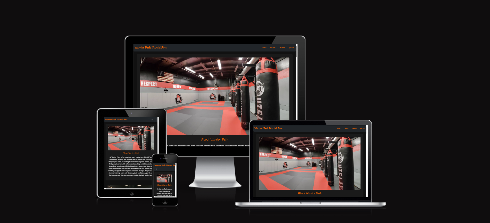

## Purpose

This project simulates the development of a professional front-end website for a martial arts gym, intended to showcase a clean, accessible, and responsive design. The goal is to create a clean, accessible and responsive website that aims to provide visitors with clear and easy access to essential information such as class offerings, trainer profiles, educational content on mixed martial arts (MMA) and membership sign-ups. This project also emphasises practical application of UX principles while showcasing semantic HTML, and CSS best practices.

### Key Features

- Mobile-first responsive design using Bootstrap.
- Informative sections on coaches, classes, pricing, and testimonials.
- A visually engaging layout that balances energy with readability.


- **Responsive Layout:** Utilizes Bootstrap 5’s grid system and media queries to ensure the site adapts elegantly to all screen sizes.
- **Navigation:** Fully functional, sticky navigation bar with clear active states provides easy and consistent site navigation.
- **Consistent Styling:** Harmonised colour palette and typography maintain a professional and approachable brand image. A dark theme was chosen for the background to create a sleek, professional appearance. Red was considered too aggressive for a martial arts website, so orange was chosen instead to add vibrancy and pop against the dark background.
- **Custom Forms:** Accessible and user-friendly sign-up form with validation prompts to facilitate membership registration.
- **Standards Compliant:** HTML and CSS validated with zero errors, ensuring cross-browser compatibility and clean code.
- **User-friendly** Sign-up form and call-to-action areas.
- **Accessibility:** Designed with keyboard navigation, focus indicators and ARIA attributes to support users with disabilities.

#### Key interactive features include:

- A **"Sign Up Today"** call-to-action near the top and again near the footer.
- Informative sections on **opening hours**, **pricing**, and **student testimonials**.
- Clear explanations of **junior** and **adult** classes.
- Embedded form for **sign-ups and enquiries**.
- Mobile layout with flow from intro to action.

The design encourages exploration without distraction, suitable for both first-time visitors and returning students.

## User Goals

- Fast and clear access to class information.
- Easy navigation across devices. 
- Modern, mobile-friendly layout.
- Confidence in the instructors through testimonials and coach bios.
- Transparent pricing and schedule overview.
- A simple, accessible way to sign up or ask questions.  
- A motivating, energetic aesthetic without clutter.


| User Goals                                 | Site Goals                                  |
|--------------------------------------------|---------------------------------------------|
| Learn about available classes              | Present offerings clearly and concisely     |
| Understand trainer qualifications          | Build trust through professional profiles   |
| Register for a class easily                | Provide a seamless, error-free sign-up form |
| Browse the site on any device              | Ensure full responsiveness and accessibility|

## User Stories

- As a first-time visitor, I want to quickly understand what kinds of martial arts are taught here.  
- As a parent, I want to know if there are junior classes suitable for my child’s age.  
- As a returning user, I want to find coach profiles easily.  
- As a prospective student, I want to see clear pricing and know what to expect before joining.  
- As a user on mobile, I want everything to be scrollable and legible without pinching or zooming.  
- As someone unfamiliar with martial arts, I want the tone to feel welcoming and non-intimidating.  
- As an accessibility-conscious user, I want keyboard focus indicators and readable font contrast.  
- As a motivated learner, I want to sign up or express interest directly from the page.

## Value to Users

The website helps users understand what the school offers, who the instructors are, and how to sign up. It also gives them an impression of the school's tone and style. Clear navigation and responsive design make it easy to use on any device. Users can quickly find detailed class information, learn about the expertise of trainers, and easily join the gym through an intuitive sign-up form. The website's responsive design ensures seamless usability across devices, while accessibility makes it inclusive for users with visual impairments.

## Website Goals and Objectives

- Clearly communicate the types of martial arts offered (striking and grappling styles).
- Appeal to a wide range of users, including adults, teens, and parents of young children.
- Highlight the professionalism of the coaching team and training environment.
- Make joining easy with a clean, accessible sign-up form and call-to-action sections.
- Build trust and interest through testimonials and coach bios.
- Ensure high accessibility through readable fonts, strong colour contrast, and focus indicators.
- Improve visibility through mobile-first design, semantic HTML, and SEO-friendly structure.

## Target Audience

The main audience includes:

- Beginners interested in joining a martial arts class for the first time.
- Adults seeking self-improvement through martial arts.
- Parents looking for safe, structured activities for children.
- Teens interested in competitive or recreational combat sports.
- Fitness-focused individuals looking for striking or grappling-based alternatives to gyms.
- Returning martial artists seeking a new place to train.
- Experienced martial artists seeking new instructors or facilities

The design and layout reflect balances accessibility and approachability which caters to all of these groups.

## Wireframes

Wireframes were created using Balsamiq, following a mobile-first approach in line with best practices. I started by sketching layouts for mobile screens and then expanded them for tablet and desktop to make sure the structure worked at all breakpoints.

The final live site follows the overall structure of the wireframes but a few adjustments were made during development to improve flow, responsiveness, and accessibility:

- The info section was simplified into a vertical scroll layout for mobile readability.
- Class types were clearly split into Junior and Adult categories to help users find what they need.
- Images were updated to better reflect striking and grappling martial arts.
- Some sections were reordered slightly to improve reading experience on mobile.
- Bootstrap’s grid system was used to restructure a few blocks for better responsiveness.

The final site remains a single scrollable page, designed to reduce navigation friction and support smooth exploration across all devices.

**Wireframe links:**

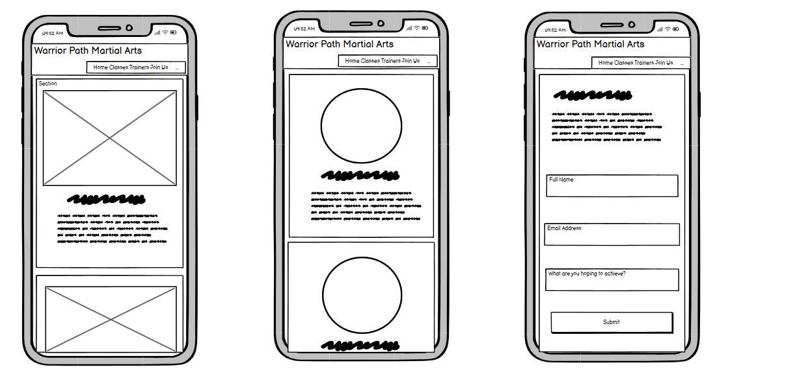
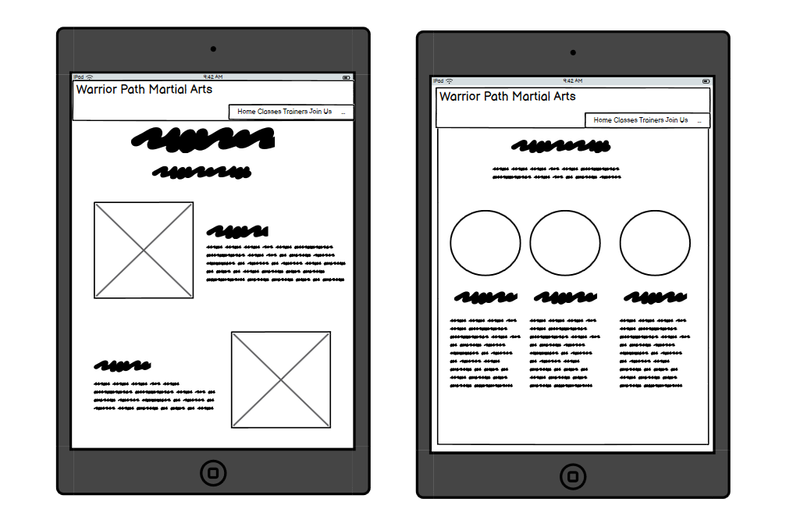
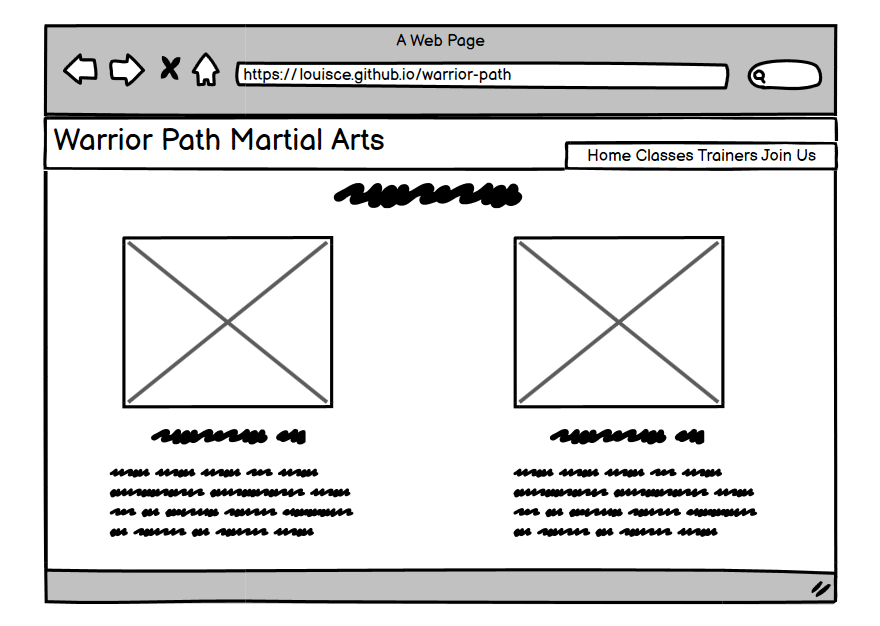

## UX Design Approach

I created this project while following key UX design principles, such as:

- **User Research:** I considered the expectations of gym members, parents, and martial artists. Common goals include finding schedules, reading about instructors, looking at prices.
- **Wireframing:** BI sketched rough layouts to visualise navigation flow and content hierarchy.
- **Visual Hierarchy:** Used font sizes, spacing, and colour contrast to guide user attention. Primary CTAs are positioned prominently.
- **Accessibility First:** ARIA labels, alt text, tab order, and contrast were used from the outset, not added after. (will add more ARIA later)
- **Feedback Loops:** Peer review and user feedback from mentors and alumni helped identify areas to improve clarity and layout.

## Design Choices

- **Orange highlights**: Used for focus and hover states to guide user interaction.
- **Responsive design**: Ensures usability on phones, tablets, and desktops.
- **Bootstrap 5**: Chosen for its ease of use and mobile-first approach.
- **Image consistency**: All images follow a clean and modern visual style.
- **Alt attributes**: Support screen readers and visually impaired users.

### Typography

The primary font families chosen for Warrior Path Martial Arts are [Inter](https://fonts.google.com/specimen/Inter "Inter") and [Macondo](https://fonts.google.com/specimen/Macondo "Macondo").  
- **Inter** is a modern, highly legible sans-serif typeface that ensures clarity for all body text across devices.  
- **Macondo** is a decorative, handwritten-style font used for headings to reflect the spirited, traditional identity of martial arts.  
This combination creates a balance between readability and stylistic flair that aligns with the ethos of Warrior Path — discipline and fun.

### Colour Scheme

The Warrior Path website uses a bold, bright orange colour palette to reflect energy, confidence, and focus:
- **Primary Accent:** `#ff6600` – a vibrant orange, symbolising strength, action, and urgency.
- **Hover Accent:** `#ffa040` – a softer orange tone used for hover states and calls to action.
- **Base Theme:** `#1a1a1a` dark grey/black background to enhance contrast and create a striking visual hierarchy.
- **Text Colour:** White and light greys for high legibility against the dark theme.

All colours were chosen with accessibility and visual impact in mind. The palette is consistent with martial arts branding and helps create a sense of professionalism and energy. The dark background provides a sleek, professional appearance while the bright orange pops against the black for high visibility. Red was considered in place of orange but I thought it would be too aggressive and intimidating for a martial arts website.

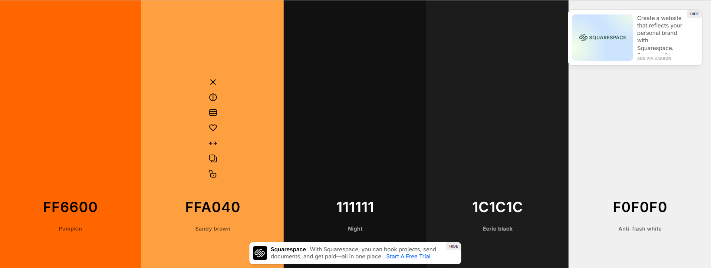

Contrast grid was also used so that I could get more ideas for shades of colours that would fit my website's theme.

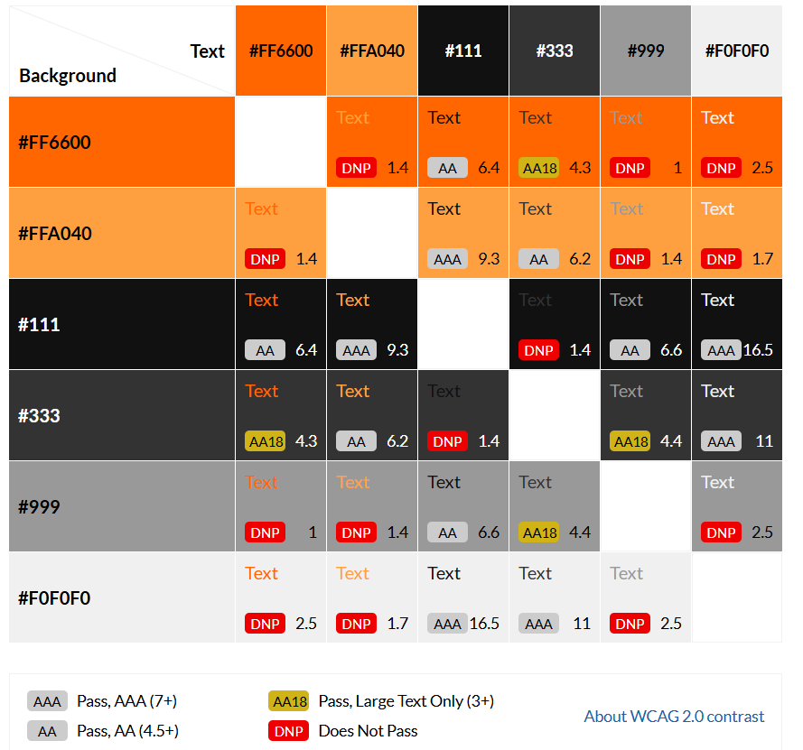

### Images

The site uses a curated collection of imagery designed to reflect the spirit of martial arts. Images were chosen from Google Images to represent:

- **Juniors and Seniors** training in a focused, welcoming environment.
- **Striking arts** like Muay Thai and Boxing, with photos showing pad work and form.
- **Grappling arts** like Wrestling and Brazilian Jiu Jitsu, displaying movement and control.

All images were resized and compressed for performance. Where appropriate, Bootstrap’s responsive classes and custom CSS ensured that visuals scale naturally across devices without causing layout issues or horizontal scrolling.

Images complement the tone of each section and provide immediate visual context for the training styles available.

### Responsiveness

The website was built mobile-first, ensuring usability across a wide range of devices. I used Bootstrap 5’s responsive grid system in combination with custom CSS media queries to handle layout adjustments. The navigation bar becomes a collapsible menu on small screens, and content sections stack vertically to prioritise readability.

Testing across device emulators and real devices helped ensure layouts didn't break at key breakpoints (576px, 768px, 992px, 1200px). Particular care was taken to ensure:

- Text remains legible without zooming.
- Tap targets are large and well-spaced.
- Visual hierarchy remains clear across screen sizes.

Each section, from the hero header to the info columns and call-to-action, adapts layout and spacing across devices to maintain readability and flow. Flexbox and utility classes helped ensure clean stacking on mobile while preserving side-by-side content on larger screens.

# Features

The website layout is clean, focused, and built for clarity. Visitors can scroll through all content in a single-page layout, mimicking a modern one-page structure like Instagram, Facebook and LinkedIn. Section transitions are smooth, content is clearly separated, and visual hierarchy ensures no part overwhelms the user.

## Existing Features

- Home (`index.html`)
- Classes (`classes.html`)
- Trainers (`trainers.html`)
- Join Us (`signup.html`)

### Header

The site features a simplified custom navbar that maintains consistency across screen sizes. It includes a Macondo font for a tough, yet elegant aesthetic and a menu with multiple options (i.e. Home, Classes, Trainers, Join Us).

- **On mobile:** the menu condenses for vertical space efficiency.
- **On desktop:** full links are displayed inline for ease of access.
- The minimalist styling and contrast ensure high visibility and accessibility.


### Hero Section
The homepage opens with a bold hero banner that immediately communicates the purpose of the site, to inspire and motivate users to begin their martial arts journey.

- Eye-catching banner introduces the brand
- Clear navigation to other pages
- Welcoming call to action

The hero banner displays a large, full-width image accompanied by a bold heading ("Unlock Your Potential") and a primary call-to-action button ("Sign Up Today").

- Image scales cleanly across devices.
- Typography is centered and resized based on screen width.

This section creates immediate visual impact and sets the tone for the rest of the page.

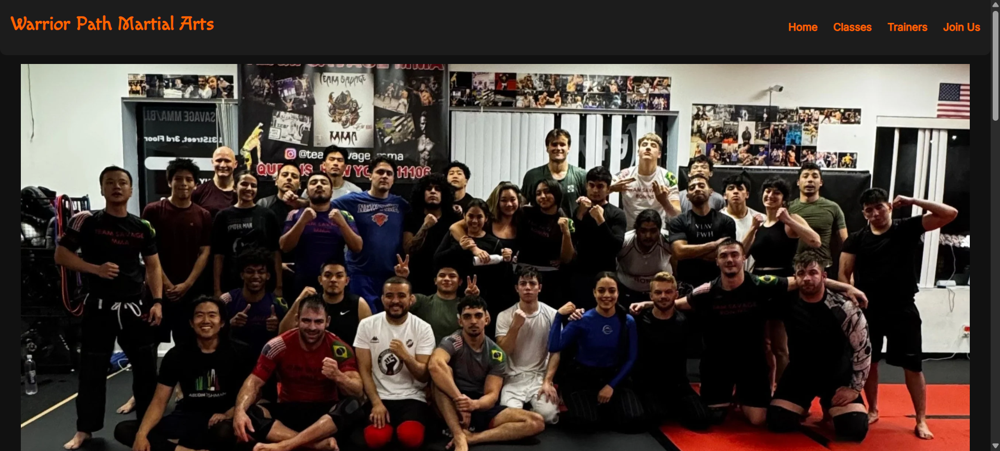

### About Section
Provides a warm, community-focused introduction to the gym’s mission, values, and atmosphere. Perfect for new visitors trying to understand the vibe.


### Info Columns

Below the hero, three main content columns communicate:

- **Timetable and Opening Hours**
- **Testimonials from Students and Parents**
- **Pricing Structure**

These are stacked on mobile for ease of reading and display in columns on larger screens. Icons and images enhance visual separation and aid scannability.

### Pricing & Testimonials
These blocks use card layouts for easy scanning. Testimonials help build trust, while pricing is clear and friendly. Cards are fully responsive and stack beautifully on mobile.


### Our Classes

Class sections are divided by age group and discipline:

- **Juniors:** safe, structured programs for kids.
- **Adults:** more intensive classes for adults.
- **Striking & Grappling:** users can visually identify the martial arts discipline via imagery and layout.

This separation helps potential students or parents quickly find relevant info.

- Grid layout displaying available classes
- Descriptions help users choose the right program

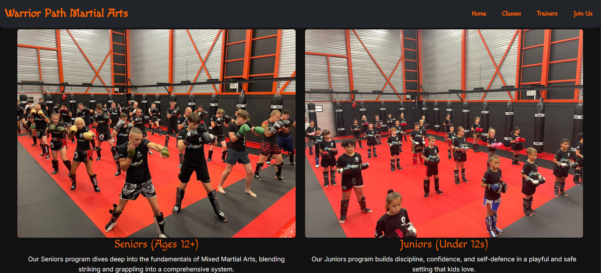

### Mixed Martial Arts Breakdown

Breaks down martial arts disciplines into striking and grappling, clearly explaining the four disciplines that Warrior Path teaches without being overwhelming. 

Among the striking arts are:

- **Boxing**
- **Muay Thai**

Among the grappling arts are:

- **Wrestling**
- **Brazilian Jiu Jitsu**

Alternating layouts with images help keep the page dynamic and readable.

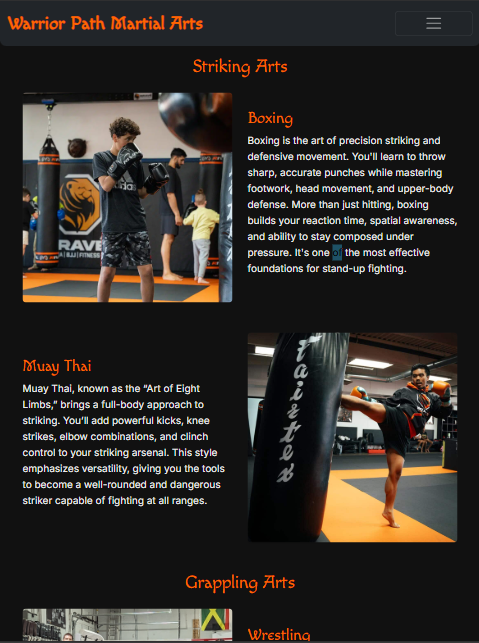

### Meet the Coaches

Instructor bios are accompanied by photographs in circular format, names and short role descriptions. All sections are vertically stacked on small screens and aligned in columns on desktops.

- Profile cards for each instructor
- Bio and specialties provided for each trainer

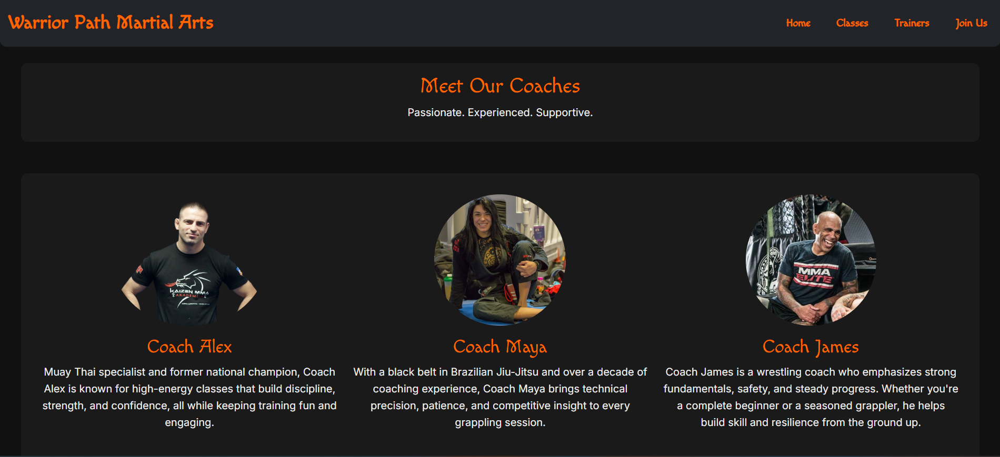

### Signup Form

At the bottom of the page is a call-to-action form that includes:

- Full name  
- Email address  
- What are you hoping to achieve? 
- Designed for easy user interaction

 Includes a working contact form to book a free first lesson. Fields are clearly labeled and spaced. All fields are required. A thank you message confirms submission.

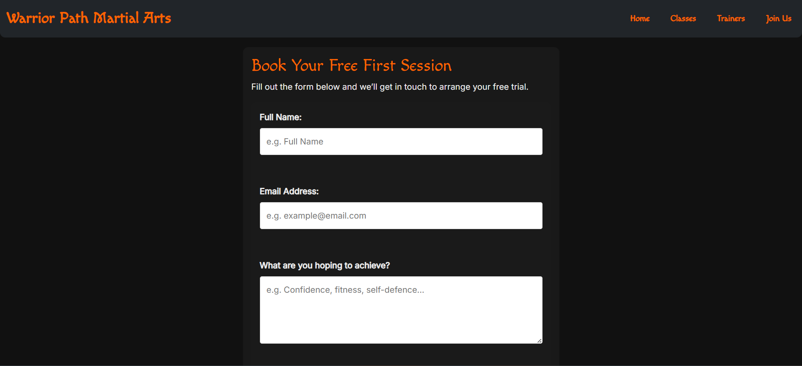
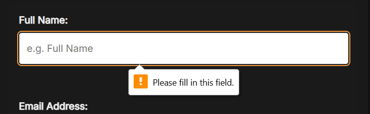
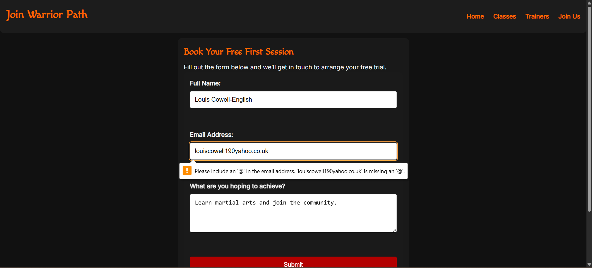
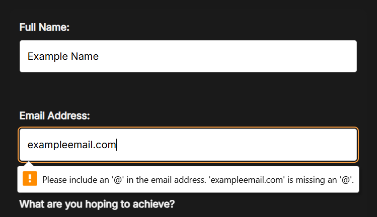
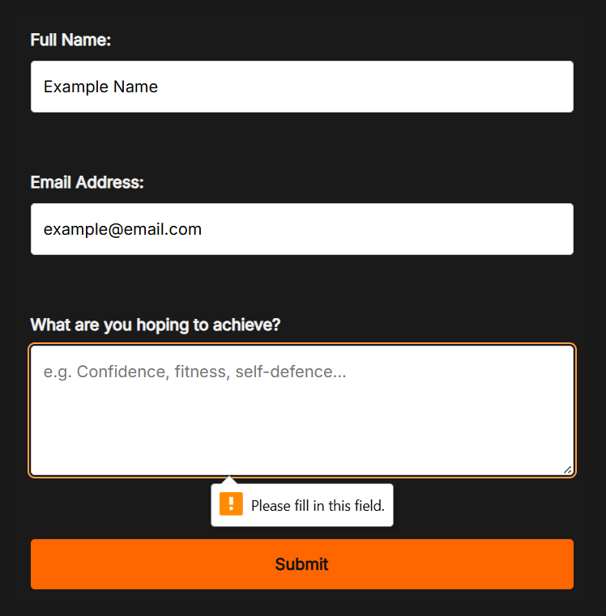

## Landing View

The site follows a single-page application layout to maintain fast performance, a smooth Instagram-like scroll experience, and intuitive structure. The landing section includes:

- **Hero headline** encouraging users to start their journey.
- **Sign Up Today** button with hover animation.
- **Branding** that introduces the ethos of Warrior Path Martial Arts.

All interactions are mobile-optimized. Buttons are styled consistently across the page with high-contrast colour and accessible sizing. Layout adapts naturally for smaller screens.

## Class Overview Sections

The class descriptions are divided by age group and discipline, making it easier for users to identify relevant training options:

- **Juniors vs Adults:** Clear headings and age-appropriate imagery  
- **Striking vs Grappling:** Distinct sections that introduce the techniques and training formats  

Each section is accompanied by supportive visuals and concise descriptions to help new visitors understand the benefits of different martial arts.

## Coach Profiles

The trainer section provides a human touch, with:

- **Photographs** of each instructor.
- **Name and role** clearly labeled.
- **Consistent formatting** and alignment across screen sizes.

This builds credibility and trust with site visitors, especially parents considering classes for children.

## Sign-Up Form

The sign-up form serves as the call-to-action section of the page. It includes required fields:

- **Name**
- **Email**
- **What are you hoping to achieve?**

Users are encouraged to register their interest or request more information. Form fields are validated to avoid incomplete submissions. A confirmation message assures the user that their query was received.

## Footer

The footer is designed with simplicity and elegance to align with the site’s clean, minimal aesthetic.

- Contains links to the studio’s **social media**. 
- **Icons are spaced** for touch accessibility.
- Styled with **hover effects** in keeping with the rest of the UI.

## Submission Confirmation Page

I added a confirmation page to make it clear to the user that their form has been submitted.

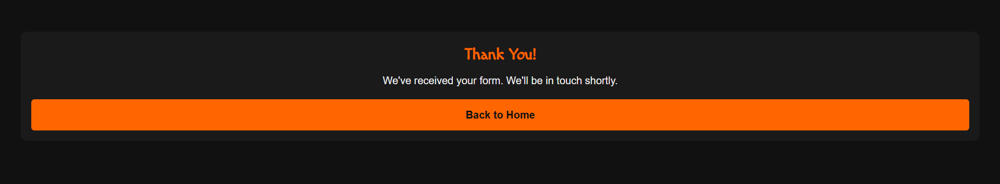

## 404 Page

I added a fun and onbrand custom 404 error page to handle broken or mistyped URLs so that the user has a positive experience, even when visiting a nonexistent page.

- Displays a **clear error message**.
- Includes a **5-second redirect** to the homepage.
- Also features a **home icon** for immediate manual return.

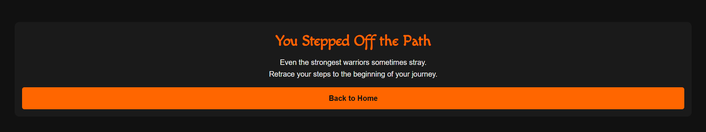

## Future Enhancements

- **Class Booking Integration:** Add calendar-based booking functionality where users can reserve a free trial or regular class session.
- **Online Payment System:** Integrate payment functionality for memberships or merchandise.
- **Member Portal:** Allow registered users to log in, track attendance, view schedules, and manage their training plans.
- **Live Timetable:** Implement a dynamic, filterable timetable that updates in real time.
- **Coach Video Introductions:** Embed short video bios or class previews for each coach.
- **Light Mode Toggle:** Introduce theme options to improve UX for users.
- **Accessibility Enhancements:** Further improve keyboard navigation and screen reader compatibility. Also, add ARIA roles and landmarks.
- **Blog/News section:** To keep members updated.
- **Improve SEO:** By adding meta descriptions and structured data.

## Technologies Used

- HTML
- CSS
- JavaScript

### Frameworks & Libraries

- Bootstrap 5
- Font Awesome
- Google Fonts

### Tools & Platforms

- GitHub
- VS Code
- Balsamiq
- W3C HTML Validator
- W3C CSS Validator
- JSHint
- Color Contrast Checker
- Am I Responsive
- Responsive Design Checker

# Testing

## Bug & Testing Log

- Tested the website thoroughly on Chrome and DevTools across all major breakpoints (mobile, tablet, desktop).
- HTML and CSS were validated using the W3C Markup and Jigsaw CSS Validators with zero errors.
- JavaScript was linted using JSHint with `esversion: 6` specified; no functional issues detected.
- All images have descriptive `alt` attributes to ensure full accessibility support.
- Verified keyboard navigation across all sections. Interactive elements (like links, buttons, and form fields) show clear focus outlines in high-contrast orange (#ffa040), matching hover states for consistency.
- All anchor links were tested for smooth scrolling and accurate navigation, including offset adjustments to account for the fixed navbar.
- External links (e.g. social media) open in new tabs and use `rel="noopener noreferrer"` for improved security and performance.
- The responsive layout was tested across devices and emulators. CSS media queries adjust layout fluidly across screen sizes with no major breakage or content overflow.
- A horizontal scrolling bug was diagnosed and fixed by identifying overly wide grid structures and adjusting image behavior.
- Site was tested using [Responsive Design Checker](https://responsivedesignchecker.com) and on a real mobile phone. No unexpected scroll or layout issues were found.
- Form functionality was tested. On submission, the user is correctly redirected to a success page.
- When /samurai is added to the url bar, it takes the user to a 404 page.
- All JavaScript functions (navbar toggle logic, form redirection, etc.) were confirmed working on mobile and desktop.

No unresolved bugs remain. All critical and visual issues have been addressed.

## Responsiveness Tests

# Code Validation

### HTML

[W3C HTML Validation Service](https://validator.w3.org/ "W3C HTML") was used to validate my index.html, success.html and 404.html. All three came back without errors. This can be seen below.

**Main page**

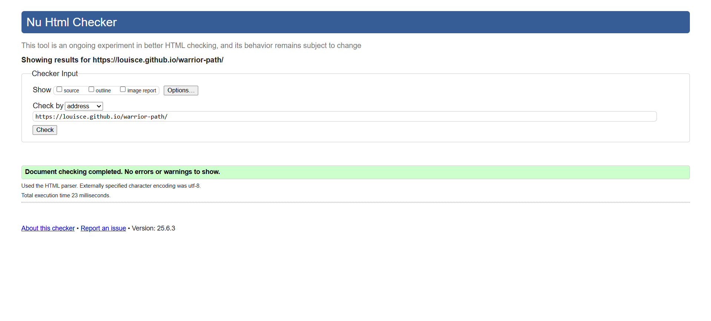

**Form submitted page**

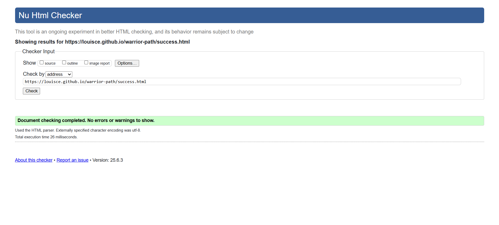

**404 error page***

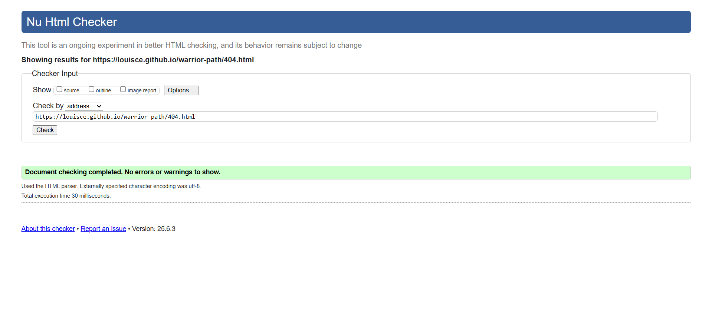

### CSS

https://jigsaw.w3.org/css-validator/ was used to validate my style.css. Similar to my html files, no errors came back related to my style.css, which is shown below.

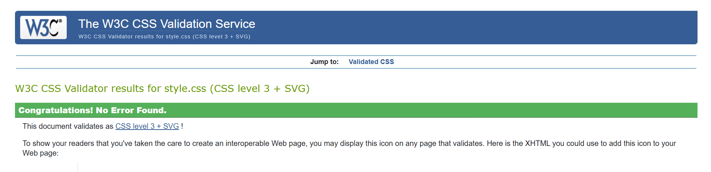

### JavaScript

I used [JSHint](https://jshint.com/ "JSHint") to validate my JavaScript. Again, no errors detected.

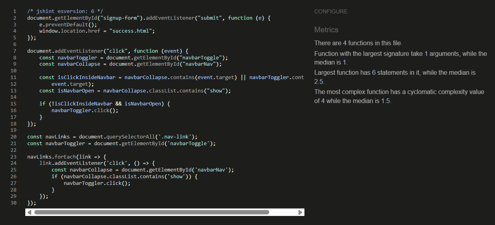

## User Story Testing

| User Story                                                                                       | How It Was Addressed                                                                                          | Pass | Screenshot                                                   |
|--------------------------------------------------------------------------------------------------|---------------------------------------------------------------------------------------------------------------|------|--------------------------------------------------------------|
| As a first-time visitor, I want to quickly understand what kinds of martial arts are taught here. | Clear class descriptions for striking (Boxing, Muay Thai) and grappling (Wrestling, Jiu Jitsu) are shown.    | Yes  |                |
| As a parent, I want to know if there are junior classes suitable for my child’s age.             | Juniors section explains age groups and class types in accessible language.                                   | Yes  |                     |
| As a returning user, I want to find coach profiles easily.                                       | Coaches section is clearly labeled in the navbar and includes profile images and bios.                        | Yes  |                     |
| As a prospective student, I want to see clear pricing and know what to expect before joining.    | Pricing block is simple, scrollable and visible near the top of the page.                                     | Yes  |                       |
| As a user on mobile, I want everything to be scrollable and legible without pinching or zooming. | Fully responsive layout with Bootstrap grid and media queries; tested on real phone and DevTools.             | Yes  |                   |
| As someone unfamiliar with martial arts, I want the tone to feel welcoming and non-intimidating. | Friendly copywriting, beginner-friendly descriptions, and call-to-actions with encouragement.                 | Yes  |                       |
| As an accessibility-conscious user, I want keyboard focus indicators and readable font contrast. | Focus outlines, large readable fonts, and high colour contrast were manually and programmatically tested.      | Yes  | See [Accessibility Testing](#accessibility-testing)         |
| As a motivated learner, I want to sign up or express interest directly from the page.            | Call-to-action form at the bottom allows users to enter their details; success message and redirect included. | Yes  |                         |

## Feature Testing

I manually tested every feature of the Warrior Path website using Chrome and DevTools. This includes buttons, forms, navigation links, interactive JavaScript features and mobile responsiveness.

All core features were tested against expected behaviors, including:

- Navigation links scroll smoothly to the correct section.
- The mobile navbar toggles open and closed as expected.
- The contact/signup form correctly redirects to a confirmation page.
- The layout remains consistent and readable at all major breakpoints.
- Image scaling, padding and section spacing all respond properly on different devices.
- Keyboard focus outlines are visible on interactive elements for accessibility.

Testing was done throughout development and final checks were made once the content and layout were complete.

[Feature Testing Results](docs/feature-test-results.pdf "Feature Testing Results")

## Accessibility Testing

Accessibility was a key priority in the design and development of Warrior Path Martial Arts. I implemented the following measures to support inclusive use:

- **Responsive layout** using Bootstrap 5.3.7 ensures readability across all devices, from mobile phones to large desktops.
- **Semantic HTML5 tags** such as `<header>`, `<nav>`, `<section>`, and `<footer>` are used to help screen readers and assistive technology interpret the content structure correctly.
- **ARIA labels** have been included where necessary (for example, with form inputs) to provide extra context and improve form accessibility for screen readers.
- **High-contrast colours** between text and background elements aid readability.
- **Alt text** has been added for all images, making visual content accessible to visually impaired users.
- **Keyboard navigability** is preserved through standard HTML elements and logical layout.
- **Form validation** and `required` attributes ensure users receive feedback when submitting forms incorrectly.

These practices ensure the site is inclusive, usable, and compliant with basic WCAG 2.1 accessibility standards.

This website supports keyboard navigation to enhance accessibility. Interactive elements such as navigation links and call-to-action (CTA) buttons have visible `:focus` styles, allowing users who navigate using the Tab key to clearly see which element is currently selected. The focus styles use a high-contrast orange (#ffa040) consistent with the hover styles for visual continuity. Additionally, form inputs and buttons highlight on focus to assist users relying on keyboard interaction.

**Keyboard Navigation Test:**  
Pressing the Tab key cycles through all interactive elements (links, buttons, form fields). Each focused element is clearly highlighted with a bright orange outline or underline. No elements are skipped, and focus order is logical.
**Result:** Pass

## Accessibility Testing

I used the [WAVE Web Accessibility Evaluation Tool](https://wave.webaim.org/) to assess the accessibility of the deployed site.

### Summary of Results

| Type                  | Count                | Notes                                                                 |
|-----------------------|----------------------|-----------------------------------------------------------------------|
| **Errors**            | 3 Contrast Errors     | Mostly to do with muted footer text or blockquote footers.            |
| **Alerts**            | 3 Alerts              | All reviewed and either resolved or justified below.                  |
| **Features**          | 15 Features           | Good use of alternative text and ARIA labels throughout.              |
| **Structural Elements** | 27                | Proper heading levels and semantic structure used throughout.         |
| **ARIA**              | 11                    | Includes proper use of `aria-label` and other helpful roles.          |

### Contrast Errors

WAVE flagged three contrast issues. These were related to muted grey text on dark backgrounds, particularly in the `.blockquote-footer` class under Testimonials. I attempted to fix this using lighter grey tones (`#ccc`, `#ddd`) and custom overrides, but Bootstrap sometimes overpowered the styling. Since the text remains clearly legible and passed visual inspection, I decided to retain the current look. I’ve acknowledged the contrast warnings here and can revisit this post-deadline if needed.

### Alerts

There were 3 WAVE alerts, two of which were due to “Suspicious alternative text”. It seems that WAVE tends to flag alt descriptions that it considers to not be sufficiently descriptive.

I resolved these by rewriting the `alt` text for all relevant images to be more specific and contextual. For example:

```html
alt="Inside the Warrior Path gym to welcome the user into the environment"
alt="Image of the gym's interior to show off the equipment and amount of space"
alt="Students posing together to show off the gym's friendly environment"
alt="Image of a famous quote from Muhammad Ali to motivate students and users"

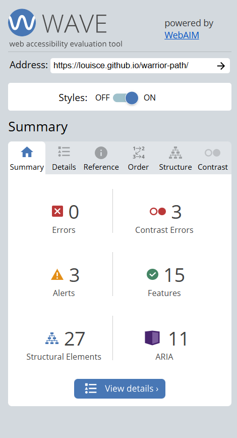

## Lighthouse Testing

I tested the website using [Google Lighthouse](https://developers.google.com/web/tools/lighthouse) in Chrome’s Incognito Mode to eliminate extension interference.

| Category        | Score |
|----------------|-------|
| Performance     | 93    |
| Accessibility   | 95    |
| Best Practices  | 100   |
| SEO             | 91    |

All categories recieved a score above 90, which can be seen below. Performance improved significantly after running in Incognito mode, with images optimised and layout tested across devices. Accessibility adjustments included ARIA labels, valid `alt` text, contrast improvements, and structural heading order.

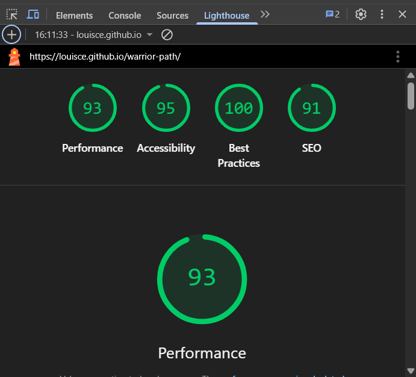
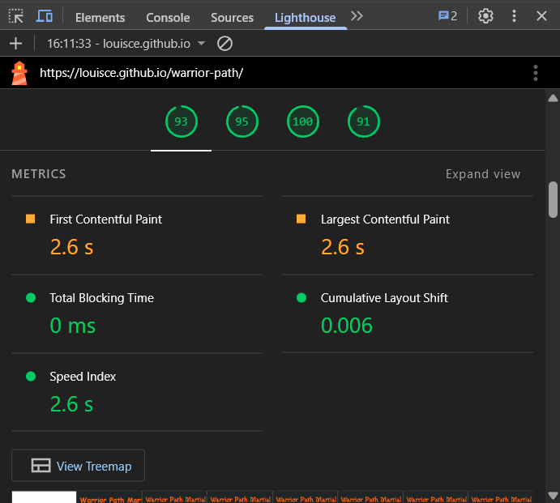

## Conclusion

All critical accessibility issues were addressed. Minor alerts and contrast warnings are documented and do not hinder usability. The final Lighthouse audit confirmed a strong Accessibility score of 95/100, and the WAVE tool shows no major issues remaining.

## Browser Testing

## Deployment

The website is deployed using GitHub Pages and is accessible at:  
[Warrior Path Martial Arts](https://louisce.github.io/warrior-path/)

## To deploy the project:

Use GitHub Pages.

1. Log in (or sign up) to GitHub.
2. Go to the repository for this project: [LouisCE/warrior-path](https://github.com/LouisCE/warrior-path).
3. Click the **Settings** tab.
4. In the left-hand sidebar, click on **Pages**.
5. Under **Source**, select `main` branch and click **Save**.
6. GitHub Pages will build and deploy the site. You may need to wait a minute for the changes to go live.


### To fork the project

To fork the repository:

1. Log in (or sign up) to GitHub.
2. Go to the project repo: [LouisCE/warrior-path](https://github.com/LouisCE/warrior-path).
3. Click the **Fork** button in the top right.

### To clone the project

To clone the repository:

1. Log in (or sign up) to GitHub.
2. Open the project repository.
3. Click the **Code** button and copy the link (HTTPS recommended).
4. Open your terminal and navigate to where you'd like the repo to live.
5. Type: `git clone <paste-url-here>` and hit Enter.

## Lessons Learned

- I learned how VS Code and GitHub work together to deploy live websites.
- I deepended and consolidated my understanding of HTML and CSS.
- I gained a basic understanding of JavaScript.
- I learned how to troubleshoot and find bugs more efficiently.
- I deepened my understanding of responsive layout with Bootstrap's grid system.
- I learned why it's important to design for accessibility from the beginning, rather than fitting it at the end.
- Balancing visual design with semantic HTML taught me how to build with both users and machines (screen readers and search engines) in mind.
- Using GitHub Pages for deployment reinforced the importance of version control and remote collaboration tools.

# Credits

## Acknowledgments

- Code Institute's Learning Management System (LMS) taught me HTML and CSS, as well as showing me detailed walkthroughs on the work that goes into web design, reinforcing page structure and strategising
- Peer review and feedback from Slack provided valuable insights.
- Simen is my mentor. He hosted video calls reviewing my progress. We did an inception call, a midpoint call and a project review. He gave valuable advice on how to think like a developer that helped me to complete my project. Thank you, Simen.
- Credit is also due to Tim who looked at my progress and provided me with a checklist of things that I should cover.
- I'd also like to thank my facilitator, Kay for providing valuable information and answering questions about the grading criteria and course material.
- Cam is one of the alumni at Code Institute and he was also a massive help, especially in the early stages when I was having trouble deploying my live website and later on when he pointed out specific things I need to fix or add.
- Images came from Google Images.