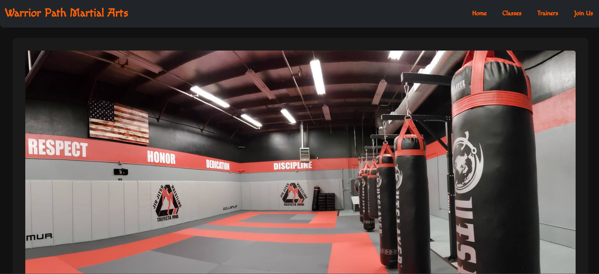
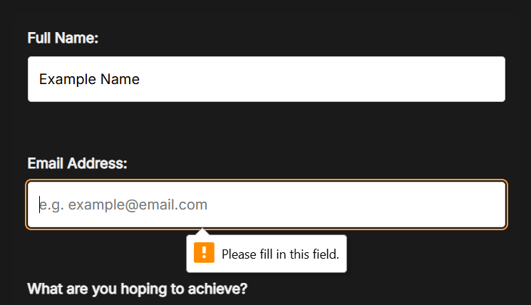

# Warrior Path

**Warrior Path** is a fictional martial arts gym website developed as part of a front-end development project for Code Institute in 2025. This project demonstrates skills in responsive design, accessibility, and front-end best practices using HTML, CSS and Bootstrap.

Warrior Path Martial Arts is a responsive, one-page website designed to promote a dynamic and inclusive martial arts school. It provides key information about classes, coaching, and sign-up opportunities for both adults and juniors. With a clean layout, smooth scroll-friendly Instagram-like navigation, and carefully chosen visuals, the site delivers an engaging experience across all devices.

Whether you’re a curious beginner, a parent looking for the right class for your child, or a seasoned martial artist seeking expert coaching, Warrior Path makes the journey clear, accessible, and inspiring.

### Key Features

- Mobile-first responsive design using Bootstrap.
- Informative sections on coaches, classes, pricing, and testimonials.
- A visually engaging layout that balances energy with readability.
- A user-friendly sign-up form and call-to-action areas.
- Accessibility-focused features like keyboard navigation and focus indicators.

## Table of Contents

- [Purpose](#purpose)
- [Value to Users](#value-to-users)
- [Key Features](#key-features)
- [Pages Included](#pages-included)
- [Deployment](#deployment)
- [Technologies Used](#technologies-used)
- [Screenshots](#screenshots)
- [Attribution](#attribution)
- [Accessibility](#accessibility)
  - [Accessibility Testing](#accessibility-testing)
- [How to Run/Preview the Project](#how-to-runpreview-the-project)
- [Bug & Testing Log](#bug--testing-log)
- [Features in Detail](#features-in-detail)
  - [Home Page](#home-page)
  - [Classes Page](#classes-page)
  - [Trainers Page](#trainers-page)
  - [Join Us Page](#join-us-page)
- [Target Audience](#target-audience)
- [Design Decisions](#design-decisions)
- [Future Improvements](#future-improvements)

## User Goals

- Fast and clear access to class information.
- Easy navigation across devices. 
- Modern, mobile-friendly layout.
- Confidence in the instructors through testimonials and coach bios.
- Transparent pricing and schedule overview.
- A simple, accessible way to sign up or ask questions.  
- A motivating, energetic aesthetic without clutter.

## User Stories

- As a first-time visitor, I want to quickly understand what kinds of martial arts are taught here.  
- As a parent, I want to know if there are junior classes suitable for my child’s age.  
- As a returning user, I want to find coach profiles easily.  
- As a prospective student, I want to see clear pricing and know what to expect before joining.  
- As a user on mobile, I want everything to be scrollable and legible without pinching or zooming.  
- As someone unfamiliar with martial arts, I want the tone to feel welcoming and non-intimidating.  
- As an accessibility-conscious user, I want keyboard focus indicators and readable font contrast.  
- As a motivated learner, I want to sign up or express interest directly from the page.

## Website Goals and Objectives

- Clearly communicate the types of martial arts offered (striking and grappling styles).
- Appeal to a wide range of users, including adults, teens, and parents of young children.
- Highlight the professionalism of the coaching team and training environment.
- Make joining easy with a clean, accessible sign-up form and call-to-action sections.
- Build trust and interest through testimonials and coach bios.
- Ensure high accessibility through readable fonts, strong color contrast, and focus indicators.
- Improve visibility through mobile-first design, semantic HTML, and SEO-friendly structure.

## Target Audience

- Adults seeking self-improvement through martial arts.
- Parents looking for a disciplined but friendly junior program.
- Teens interested in competitive or recreational combat sports.
- Fitness-focused individuals looking for striking or grappling-based alternatives to gyms.
- Curious beginners who want a low-pressure way to explore martial arts.
- Returning martial artists seeking a new place to train.

[Back to top](#contents)

## Wireframes

Wireframes were hand-sketched during the planning stage and later refined through iterative layout changes directly in code. Following best practices, a mobile-first design approach was used. All content was structured to display clearly on phones before adapting to tablets and desktops.

Several elements evolved beyond the initial sketches during development:

- The info section was adjusted into a simplistic vertical scroll for clarity and simplicity.  
- Class types were visually split into junior and adult categories.  
- Images were refined to better reflect grappling and striking styles.  
- The layout was condensed into a single scrollable Instagram-like page to reduce navigation friction and improve mobile UX.  

[Back to top](#contents)

## Images

The site uses a curated collection of imagery designed to reflect the spirit of martial arts. Images were chosen to represent:

- **Juniors and Seniors** training in a focused, welcoming environment.
- **Striking arts** like Muay Thai and Boxing, with photos showing pad work and form.
- **Grappling arts** like Brazilian Jiu-Jitsu and Wrestling, displaying movement and control.

All images were resized and compressed for performance. Where appropriate, Bootstrap’s responsive classes and custom CSS ensured that visuals scale naturally across devices without causing layout issues or horizontal scrolling.

Images complement the tone of each section and provide immediate visual context for the training styles available.

## Responsiveness

A mobile-first approach was used throughout the build. Responsive layout changes were managed using Bootstrap’s built-in grid system and custom media queries. Key breakpoints were:

- `576px`: Large mobile
- `768px`: Tablets
- `992px`: Laptops
- `1200px+`: Desktops

Each section — from the hero header to the info columns and call-to-action — adapts layout and spacing across devices to maintain readability and flow. Flexbox and utility classes helped ensure clean stacking on mobile while preserving side-by-side content on larger screens.

[Back to top](#contents)

## Features

The website layout is clean, focused, and built for clarity. Visitors can scroll through all content in a single-page layout, mimicking a modern landing-page structure. Section transitions are smooth, content is clearly separated, and visual hierarchy ensures no part overwhelms the user.

### Key interactive features include:

- A **"Sign Up Today"** call-to-action near the top and again near the footer.
- Informative sections on **opening hours**, **pricing**, and **student testimonials**.
- Clear explanations of **junior** and **adult** classes.
- Embedded form for **sign-ups and enquiries**.
- Strong mobile layout with intuitive flow from intro to action.

The design encourages exploration without distraction, suitable for both first-time visitors and returning students.

## Existing Features

### Header

The site features a simplified custom navbar that maintains consistency across screen sizes. It includes a Macondo font for a tough, yet elegant aesthetic and a menu with multiple options (i.e. Home, Classes, Trainers, Join Us).

- **On mobile:** the menu condenses for vertical space efficiency.
- **On desktop:** full links are displayed inline for ease of access.
- The minimalist styling and contrast ensure high visibility and accessibility.

### Hero Section

The hero banner displays a large, full-width image accompanied by a bold heading ("Unlock Your Potential") and a primary call-to-action button ("Sign Up Today").

- Image scales cleanly across devices.
- Typography is centered and resized based on screen width.

This section creates immediate visual impact and sets the tone for the rest of the page.

### Info Columns

Below the hero, three main content columns communicate:

- **Timetable and Opening Hours**
- **Testimonials from Students**
- **Pricing Structure**

These are stacked on mobile for ease of reading and display in columns on larger screens. Icons and images enhance visual separation and aid scannability.

### Class Descriptions

Class sections are divided by age group and discipline:

- **Juniors:** safe, structured programs for kids.
- **Adults:** competitive or fitness-based training options.
- **Striking vs Grappling:** users can visually identify the martial arts discipline via imagery and layout.

This separation helps potential students or parents quickly find relevant info.

### Coaches Section

Instructor bios are accompanied by photographs, names, and short role descriptions. This personal touch builds trust and showcases professionalism.

### Sign-Up Form

At the bottom of the page is a call-to-action form that includes:

- Full name  
- Email address  
- What are you hoping to achieve? 

All fields are required. A thank-you message confirms submission.

[Back to top](#contents)

## Landing View

The site follows a single-page application layout to maintain fast performance, a smooth Instagram-like scroll experience, and intuitive structure. The landing section includes:

- **Hero headline** encouraging users to start their journey.
- **Sign Up Today** button with hover animation.
- **Branding** that introduces the ethos of Warrior Path Martial Arts.

All interactions are mobile-optimized. Buttons are styled consistently across the page with high-contrast color and accessible sizing. Layout adapts naturally for smaller screens.

[Back to top](#contents)

## Class Overview Sections

The class descriptions are divided by age group and discipline, making it easier for users to identify relevant training options:

- **Juniors vs Adults:** Clear headings and age-appropriate imagery  
- **Striking vs Grappling:** Distinct sections that introduce the techniques and training formats  

Each section is accompanied by supportive visuals and concise descriptions to help new visitors understand the benefits of different martial arts.

## Purpose

This project simulates the development of a professional front-end website for a martial arts gym, intended to showcase a clean, accessible, and responsive design. The goal is to create a clean, accessible and responsive website that aims to provide visitors with clear and easy access to essential information such as class offerings, trainer profiles, educational content on mixed martial arts (MMA) and membership sign-ups. This project also emphasises practical application of UX principles while showcasing semantic HTML, and CSS best practices.

## Value to Users

The website helps users understand what the school offers, who the instructors are, and how to sign up. It also gives them an impression of the school's tone and style. Clear navigation and responsive design make it easy to use on any device. Users can quickly find detailed class information, learn about the expertise of trainers, and easily join the gym through an intuitive sign-up form. The website's responsive design ensures seamless usability across devices, while accessibility makes it inclusive for users with visual impairments.

## UX Design Approach

This project followed key UX design principles, such as:

- **User Research:** I considered the expectations of gym members, parents, and martial artists. Common goals include finding schedules, reading about instructors, looking at prices.
- **Wireframing:** Before coding, I sketched rough layouts to visualise navigation flow and content hierarchy. (will add wireframe screenshot later)
- **Visual Hierarchy:** Used font sizes, spacing, and color contrast to guide user attention. Primary CTAs are positioned prominently.
- **Accessibility First:** ARIA labels, alt text, tab order, and contrast were used from the outset, not added after. (will add more ARIA later)
- **Feedback Loops:** Peer review and user feedback from mentors and alumni helped identify areas to improve clarity and layout.

## Key Features

- **Responsive Layout:** Utilizes Bootstrap 5’s grid system and media queries to ensure the site adapts elegantly to all screen sizes.
- **Navigation:** Fully functional, sticky navigation bar with clear active states provides easy and consistent site navigation.
- **Consistent Styling:** Harmonised color palette and typography maintain a professional and approachable brand image. A dark theme was chosen for the background to create a sleek, professional appearance. Red was considered too aggressive for a martial arts website, so orange was chosen instead to add vibrancy and pop against the dark background.
- **Custom Forms:** Accessible and user-friendly sign-up form with validation prompts to facilitate membership registration.
- **Standards Compliant:** HTML and CSS validated with zero errors, ensuring cross-browser compatibility and clean code.
- **Accessibility:** Designed with keyboard navigation and ARIA attributes to support users with disabilities.

## Pages Included

- Home (`index.html`)
- Classes (`classes.html`)
- Trainers (`trainers.html`)
- Join Us (`signup.html`)

## Deployment

The website is deployed using GitHub Pages and is accessible at:  
[https://louisce.github.io/warrior-path/](https://louisce.github.io/warrior-path/)

## Technologies Used

- HTML5
- CSS3
- Bootstrap 5 (via CDN)
- Git and GitHub for version control and deployment

## Responsive Design Strategy

The website was built mobile-first, ensuring usability across a wide range of devices. I used Bootstrap 5’s responsive grid system in combination with custom CSS media queries to handle layout adjustments. The navigation bar becomes a collapsible menu on small screens, and content sections stack vertically to prioritize readability.

Testing across device emulators and real devices helped ensure layouts didn't break at key breakpoints (576px, 768px, 992px, 1200px). Particular care was taken to ensure:
- Text remains legible without zooming.
- Tap targets are large and well-spaced.
- Visual hierarchy remains clear across screen sizes.

## Screenshots

_Screenshots of each page and key feature will be included here._

### Home Page

### Classes Page

### Trainers Page

### Sign Up Page

### Signup Page (Test Screenshot)

## Attribution

- Bootstrap 5 provided via official CDN: https://getbootstrap.com/
- - Fonts used: [e.g. Google Fonts - Open Sans](https://fonts.google.com/specimen/Open+Sans)

## Accessibility

This website supports keyboard navigation to enhance accessibility. Interactive elements such as navigation links and call-to-action (CTA) buttons have visible `:focus` styles, allowing users who navigate using the Tab key to clearly see which element is currently selected. The focus styles use a high-contrast orange (#ffa040) consistent with the hover styles for visual continuity. Additionally, form inputs and buttons highlight on focus to assist users relying on keyboard interaction.

### Accessibility Testing

**Keyboard Navigation Test:**  
Pressing the Tab key cycles through all interactive elements (links, buttons, form fields). Each focused element is clearly highlighted with a bright orange outline or underline. No elements are skipped, and focus order is logical.
**Result:** Pass

## How to Run/Preview the Project

You can preview the website locally by opening the HTML files directly in your web browser. No additional setup is required.

Alternatively, view the live site hosted on GitHub Pages at:  
[https://louisce.github.io/warrior-path/](https://louisce.github.io/warrior-path/)

## Bug & Testing Log

- Tested the website on Chrome, Firefox, and Edge on both desktop and mobile devices using device emulation.
- HTML and CSS files were validated using W3C and Jigsaw validators with zero errors.
- Keyboard navigation was tested, ensuring all interactive elements receive visible focus outlines with a high-contrast orange (#ffa040), consistent with hover states.
- All images include descriptive alt attributes for accessibility compliance.
- All external links open in new tabs with appropriate `rel` attributes to ensure security.
- Responsive design confirmed with CSS media queries working across multiple screen sizes.
- No critical bugs found.
- Minor issue: On very small screens (under 320px width), footer text slightly overlaps; this will be addressed in a future update.

## Features in Detail

### Home Page
- Eye-catching banner introduces the brand
- Clear navigation to other pages
- Welcoming call to action

### Classes Page
- Grid layout displaying available classes
- Descriptions help users choose the right program

### Trainers Page
- Profile cards for each instructor
- Bio and specialties provided for each trainer

### Join Us Page
- Sign-up form with name, email, class choice, and comments
- Designed for easy user interaction

## Target Audience

The primary audience includes:
- Beginners interested in martial arts classes
- Parents looking for safe, structured activities for children
- Experienced martial artists seeking new instructors or facilities

The design and layout reflect a balance of professionalism, accessibility, and approachability to cater to all of these groups.

## User Goals and Site Goals

| User Goals                                 | Site Goals                                  |
|--------------------------------------------|---------------------------------------------|
| Learn about available classes              | Present offerings clearly and concisely     |
| Understand trainer qualifications          | Build trust through professional profiles   |
| Register for a class easily                | Provide a seamless, error-free sign-up form |
| Browse the site on any device              | Ensure full responsiveness and accessibility|

## Design Decisions

- **Orange highlights**: Used for focus and hover states to guide user interaction.
- **Responsive design**: Ensures usability on phones, tablets, and desktops.
- **Bootstrap 5**: Chosen for its ease of use and mobile-first approach.
- **Image consistency**: All images follow a clean and modern visual style.
- **Alt attributes**: Support screen readers and visually impaired users.

## Future Improvements

- Fix footer overlap issue on very small mobile devices (<320px).
- Add a blog or news section to keep members updated.
- Improve SEO by adding meta descriptions and structured data.
- Enhance accessibility by adding ARIA roles and landmarks.

## Lessons Learned

- I learned how VS Code and GitHub work together to deploy live websites.
- I deepended and consolidated my understanding of HTML and CSS.
- I learned how to troubleshoot and find bugs more efficiently.
- I deepened my understanding of responsive layout with Bootstrap's grid system.
- I learned why it's important to design for accessibility from the beginning, rather than fitting it at the end.
- Balancing visual design with semantic HTML taught me how to build with both users and machines (screen readers and search engines) in mind.
- Using GitHub Pages for deployment reinforced the importance of version control and remote collaboration tools.

## Credits

### Acknowledgments

- Code Institute's Learning Management System (LMS) taught me HTML and CSS, as well as showing me detailed walkthroughs on the work that goes into web design, reinforcing page structure and strategising
- Peer review and feedback from Slack provided valuable insights.
- Credit is due to my mentor, Simen who hosted video calls reviewing my progress. We did an inception call, a midpoint call and a project review. Thank you, Simen.
- I'd also like to thank my facilitator, Kay for providing valuable information and answering questions about the grading criteria and course material.
- Cam is one of the alumni at Code Institute and he was also a massive help, especially in the early stages when I was having trouble deploying my live website.
- Images came from Google Images.
